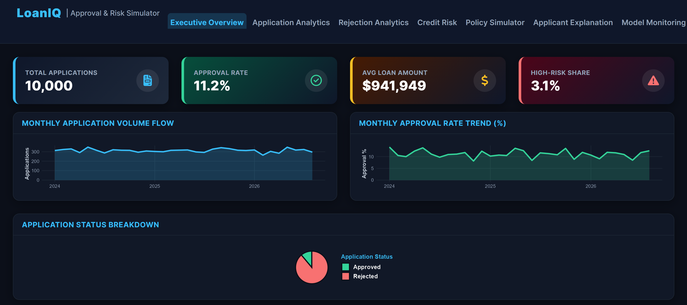

# 🏦 LoanIQ | Approval & Risk Simulator

> An end-to-end credit decisioning platform — from raw application data to a live, explainable policy simulator.

[](https://shiny.posit.co/)
[](https://xgboost.readthedocs.io/)
[](https://github.com/slundberg/shap)
[](https://www.sqlite.org/)
[](LICENSE)

---

## 📌 Executive Dashboard Overview



The LoanIQ platform analyzes **10,000 SME credit applications** with real-time underwriting metrics:

* **Total Applications:** 10,000
* **Overall Approval Rate:** 11.2%
* **Average Loan Amount:** $941,949
* **High-Risk Portfolio Share:** 3.1%

---

## 💡 Business Objectives & Dual-Model Architecture

Most SME credit decisions answer three core operational questions:
1. **Application Patterns:** Who applies for credit, and what features define approved businesses?
2. **Rejection Analytics:** Why do applicants get rejected during underwriting?
3. **Policy Simulation:** How does portfolio risk shift if underwriting thresholds change?

### Dual-Model Framework
Approval and repayment are distinct business outcomes, so they are modeled separately rather than conflated into one target:
* **Model A (Approval Prediction):** Predicts whether an applicant meets current underwriting criteria.
* **Model B (Default Risk Prediction):** Evaluates post-disbursement default probability for approved borrowers.

---

## 🖥️ Dashboard Tabs & Modules

| Tab | Module Name | Focus & Functional Capability |
| :--- | :--- | :--- |
| **1** | **Executive Overview** | Portfolio KPIs, monthly application volume flow, approval rate trends, and status splits. |
| **2** | **Application Analytics** | Approval rates segmented by sector, business age, and loan amount distributions. |
| **3** | **Rejection Analytics** | Primary rejection drivers (>4,500 high-DTI cases) and rejection rates by DTI band. |
| **4** | **Credit Risk** | Portfolio risk band distributions (Low/Medium/High) and default probability density. |
| **5** | **Policy Simulator ⭐** | Live scenario simulation adjusting min business age, max DTI, min credit score, and DSCR. |
| **6** | **Applicant Explanation** | Local SHAP waterfall charts for individual test rows and global feature importance. |
| **7** | **Model Monitoring** | Model A/B performance metrics, ROC curves, and Chi-square hypothesis test summaries. |

---

## 📊 Key Findings & Empirical Results

* **Approval Drivers:** Approval rate increases steadily with business maturity, rising from **~3.5%** for startups (<1 year) to **15.0%** for established enterprises (5+ years). The **Retail** sector shows the highest approval rate at **~11.5%**, followed by Trading (**11.0%**) and Manufacturing (**10.8%**).
* **Rejection Factors:** **High debt-to-income (DTI)** is the dominant rejection reason (>4,500 applications), followed by **insufficient collateral** (~2,200 applications). Applications with a DTI ratio above 0.7 face an **82% rejection rate**.
* **Global SHAP Drivers:** TreeSHAP identifies **Debt Service Coverage Ratio (DSCR)** as the single most important predictor of default risk (mean |SHAP| = 0.82), followed by Credit History (0.49), Collateral Value (0.44), and Annual Revenue (0.43).
* **Statistical Testing:** Chi-square tests show no statistically significant bias across sectors (χ² = 2.47, p = 0.78) or geographic locations (χ² = 2.43, p = 0.79) under current policy rules.

---

## 📈 Model Performance Benchmark

### Model A: Approval Prediction
| Model | Accuracy | Precision | Recall | F1 | ROC-AUC | PR-AUC |
|---|---|---|---|---|---|---|
| Logistic Regression | 0.90 | 0.73 | 0.26 | 0.38 | **0.88** | 0.52 |
| XGBoost | 0.90 | 0.64 | 0.24 | 0.35 | 0.87 | 0.50 |

### Model B: Post-Approval Default Risk
| Model | Accuracy | ROC-AUC | PR-AUC |
|---|---|---|---|
| Logistic Regression | 0.97 | 0.62 | 0.05 |
| XGBoost | 0.97 | 0.44 | 0.03 |

---

## 🎛️ Policy Simulator — Baseline Scenario

Baseline policy: Business Age ≥ 3 yrs, Max DTI ≤ 0.5, Credit Score ≥ 650, DSCR ≥ 1.2

| Underwriting Metric | Value |
| :--- | :--- |
| **Eligible Applications** | 287 |
| **Approval Rate** | 2.90% |
| **Low-Risk Share** | 100.00% |
| **Medium-Risk Share** | 0.00% |
| **Avg. Loan Amount** | $844,986 |

> Results reflect a simulated policy impact under this project's assumptions, not a causal real-world claim.

---

## 🗄️ SQL Analytics Sample Query

The backend relies on a normalized **5-table SQLite database** (`sme_loans.db`): `applicants`, `financials`, `credit_history`, `applications`, `loan_outcomes`.

```sql
-- Sector-wise application volume and approval rate
SELECT 
  a.Business_Sector,
  COUNT(*) AS total_applications,
  ROUND(AVG(CASE WHEN ap.Application_Status = 'Approved' THEN 1.0 ELSE 0 END) * 100, 1) AS approval_rate_pct
FROM applications ap
JOIN applicants a ON a.Applicant_ID = ap.Applicant_ID
GROUP BY a.Business_Sector
ORDER BY approval_rate_pct DESC;
```

See [`sql/analytics_queries.sql`](sql/analytics_queries.sql) for the full set of 16 analytical queries.

---

## 🛠️ Tech Stack

| Layer | Technologies & Libraries |
|---|---|
| Language | R |
| Dashboard UI | Shiny, `bslib` (Executive Dark Theme), `DT` |
| Machine Learning | `xgboost`, base `glm` (Logistic Regression), `pROC`, `PRROC` |
| Model Explainability | Native TreeSHAP (`xgboost::predict(..., predcontrib = TRUE)`) |
| Data Engine & DB | `tidyverse`, `DBI`, `RSQLite` (Normalized 5-table SQLite DB: `sme_loans.db`) |

---

## 📁 Repository Structure

```
loaniq-credit-policy-simulator/
│
├── 01_data_generation.R                 # Synthetic dataset + normalized SQLite DB
├── 02_descriptive_rejection_analysis.R  # Application KPIs + rejection analysis
├── 03_statistical_tests.R               # Chi-square, Mann-Whitney U, correlation
├── 04_credit_risk_models.R              # Model A (approval) + Model B (default)
├── 05_shap_explainability.R             # Native TreeSHAP for both models
├── app.R                                # 7-tab Shiny dashboard
│
├── sql/
│   └── analytics_queries.sql            # 16 analytical SQL queries
├── data/                                # SQLite database & structured raw data
├── models/                              # Trained ML & logistic model objects
└── README.md                            # Project documentation
```

---

## 💻 How to Run Locally

**1. Prerequisites** — install required R packages in RStudio:
```r
install.packages(c(
  "tidyverse", "xgboost", "pROC", "PRROC", "DT",
  "shiny", "bslib", "DBI", "RSQLite"
))
```

**2. Clone the repository**
```bash
git clone https://github.com/NamTas/loaniq-credit-policy-simulator.git
cd loaniq-credit-policy-simulator
```

**3. Run the pipeline in exact sequential order**
```
01_data_generation.R → 02_descriptive_rejection_analysis.R →
03_statistical_tests.R → 04_credit_risk_models.R → 05_shap_explainability.R
```

**4. Launch the dashboard**
```r
shiny::runApp("app.R")
```

---

## ⚠️ Data Note

No public dataset combines application decisions, rejection reasons, and post-disbursement repayment outcomes for SME lending in one place. This project therefore uses a **statistically structured synthetic dataset** (10,000 records, generated in `01_data_generation.R`) with realistic relationships built in e.g., higher debt-to-income → higher rejection probability, lower credit score → higher default probability. So every statistical test and model result is meaningful and internally consistent. Rejection reasons are **derived from each model's SHAP feature contributions**, mirroring how real adverse-action reason codes are generated in regulated lending rather than stored as a raw label.

---

## 🚧 Possible Extensions

- Swap the synthetic base for a real dataset (e.g. Kaggle's SBA 7(a) loan data) while keeping the same pipeline
- Add PSI-based drift monitoring to Tab 7 for periodic model recalibration tracking
- Deploy with a scheduled data-refresh job to simulate a genuinely "live" monitoring system

---

## 👤 Author

**Namira Tasnim**
CSE Graduate, Ahsanullah University of Science and Technology (AUST)
📧 tas.nam.03@gmail.com · [LinkedIn](https://linkedin.com/in/namtas) · [GitHub](https://github.com/NamTas)

---

## 📄 License

Licensed under the [MIT License](LICENSE).
